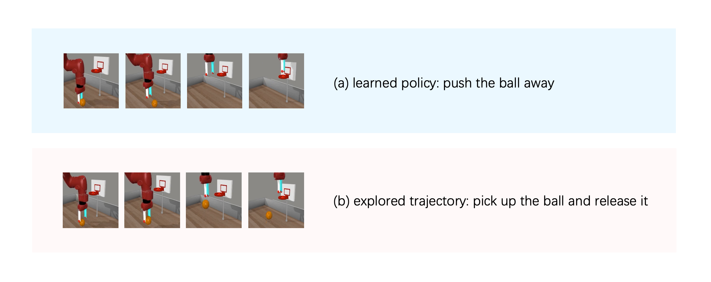
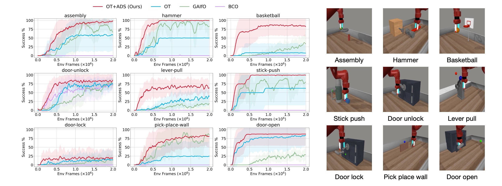

This is a poster paper for the 12th International Conference on Learning Representations (ICLR 2024). The [official code](https://github.com/dwjshift/IL_ADS) is available on GitHub.

**Paper Link:**

- Latest version: [arxiv link](https://arxiv.org/abs/2310.07433)
- [Openreview submission](https://openreview.net/forum?id=pPJTQYOpNI)


This paper focuses on the challenge known as **Imitation Learning from Observation (ILfO)**, where  robots learn by imitating the expert without access to its action. A common ILfO approach is to use a proxy reward computed from the agent's and the expert's observations. We identify that tasks with **progress dependency** property pose significant challenges for such approach, because reward signals assigned to later steps hinder the learning of initial behaviors. To address this issue, we present an **Automatic Discount Scheduling (ADS)** mechanism that adaptively alters the discount factor during the training phase, prioritizing earlier rewards initially and gradually engaging later rewards only when the earlier behaviors have been mastered. 

Here are some examples of how our ADS method performs better than SOTAs in Meta-World tasks:

<video src="index.assets/example.mp4" controls autoplay width="100%"></video>


## Motivation

Challenges on ILfO with proxy reward:  before earlier behaviors are learned, proxy rewards of later steps negatively impact the agent.



> Can explore trajectories like (b), but fails to learn grasping. This is because [Value for lifting the ball (b)] << [Value for pushing it away (a)].

## Method

For tasks with progress dependency, we restrict the impact of later rewards until the agent has mastered the previous behaviors by adaptively alters the discount factor.


## Results

Against ILfO baselines: on 9 challenging Meta-World tasks, with 8 random seeds.

​	

## Citation

```
@article{liu2023imitation,
  title={Imitation Learning from Observation with Automatic Discount Scheduling},
  author={Liu, Yuyang and Dong, Weijun and Hu, Yingdong and Wen, Chuan and Yin, Zhao-Heng and Zhang, Chongjie and Gao, Yang},
  journal={arXiv preprint arXiv:2310.07433},
  year={2023}
}
```

