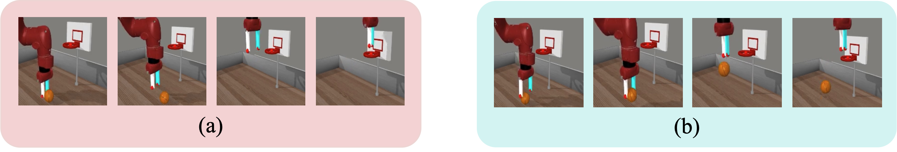

This is a poster paper of the 12th International Conference on Learning Representations (ICLR 2024). The [official code](https://github.com/dwjshift/GDIL/tree/clean) is available on GitHub.

**Paper Link:**

- Latest version: [arxiv link](https://arxiv.org/abs/2310.07433)
- [Openreview submission](https://openreview.net/forum?id=pPJTQYOpNI)


## Abstract

Humans often acquire new skills through observation and imitation.
For robotic agents, learning from the plethora of unlabeled video demonstration data available on the Internet necessitates imitating the expert without access to its action, presenting a challenge known as **Imitation Learning from Observation (ILfO)**.
A common approach to tackle ILfO problems is to convert them into Inverse Reinforcement Learning (RL) problems, utilizing a proxy reward computed from the agent's and the expert's observations.
Nonetheless, we identify that tasks characterized by a **progress dependency** property pose significant challenges for such approaches; in these tasks, the agent needs to initially learn the expert's preceding behaviors before mastering the subsequent ones.
Our investigation reveals that the main cause is that the reward signals assigned to later steps hinder the learning of initial behaviors.
To address this challenge, we present a novel ILfO framework that enables the agent to master earlier behaviors before advancing to later ones.
We introduce an **Automatic Discount Scheduling (ADS)** mechanism that adaptively alters the discount factor in RL  during the training phase, prioritizing earlier rewards initially and gradually engaging later rewards only when the earlier behaviors have been mastered.
Our experiments, conducted on nine Meta-World tasks, demonstrate that our method significantly outperforms state-of-the-art methods across all tasks, including those that are unsolvable by them.

## Motivation

Challenges on ILfO with proxy reward: failure cases.


We find that before learned earlier behaviors, proxy rewards of later steps negatively impact the agent.



> Can explore trajectories like (b), but fails to learn grasping. Value for lifting the ball (b) << Value for pushing it away (a).

## Method

For tasks with progress dependency, we restrict the impact of later rewards until the agent has mastered the previous behaviors by adaptively alters the discount factor.


## Results

Against ILfO baselines: on 9 challenging Meta-World tasks, with 8 random seeds.

​	

## Citation

```
@article{liu2023imitation,
  title={Imitation Learning from Observation with Automatic Discount Scheduling},
  author={Liu, Yuyang and Dong, Weijun and Hu, Yingdong and Wen, Chuan and Yin, Zhao-Heng and Zhang, Chongjie and Gao, Yang},
  journal={arXiv preprint arXiv:2310.07433},
  year={2023}
}
```

